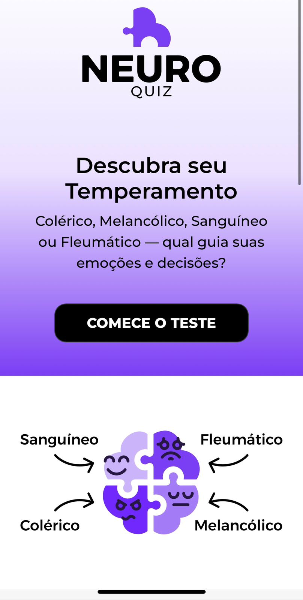
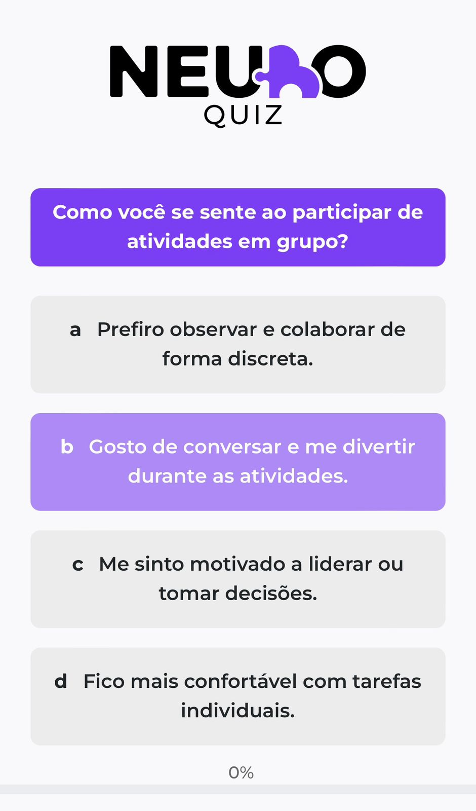
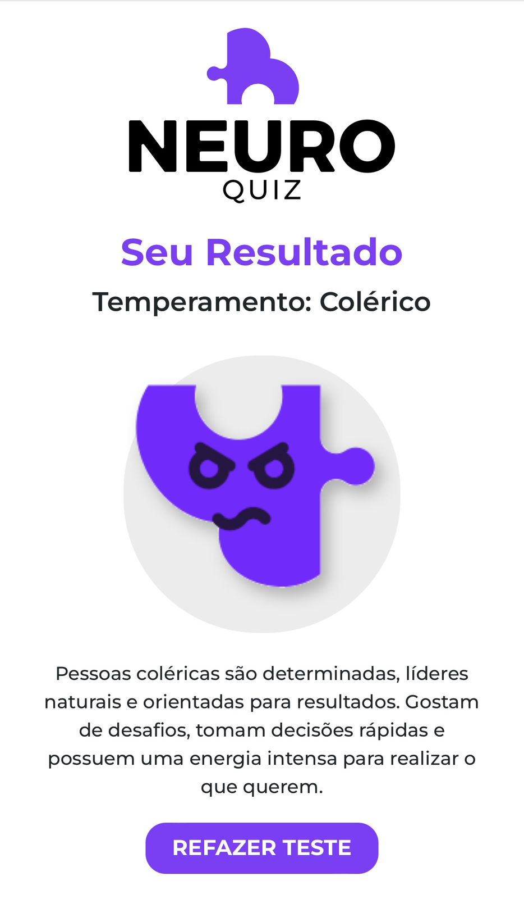

# 🧠 Teste de Temperamento

Este é um projeto acadêmico finalizado que consiste em um **quiz interativo** para identificar o **temperamento predominante** de uma pessoa com base em suas respostas.

## 🔍 Tipos de Temperamento

O teste é baseado nos quatro tipos clássicos de temperamento da psicologia:

- 🔥 **Colérico**
- 💧 **Fleumático**
- 🌬️ **Sanguíneo**
- 🌑 **Melancólico**
  

## 🎯 Objetivo

Criar uma aplicação web intuitiva, dinâmica e acessível, onde o usuário responde a uma série de perguntas e recebe, ao final, o resultado com o seu **perfil de temperamento dominante**.

## 🧠 Descubra seu temperamento
https://teste-de-temperamento-tawny.vercel.app/

## 🖼️ Preview da Aplicação

### 📌 Tela Inicial

### ❓ Tela de Perguntas

### 📊 Tela de Resultado

## 🛠️ Tecnologias Utilizadas

- 💚 **Vue.js** – Framework JavaScript progressivo usado para a construção da interface interativa.
- 📜 **JavaScript (JS)** – Responsável pela lógica do quiz, contagem de respostas e exibição dos resultados.
- 🎨 **SASS** – Utilizado para estruturar e modularizar os estilos da aplicação com maior organização.
- ⚙️ **Bootstrap** – Framework CSS para facilitar o layout responsivo e componentes visuais.

